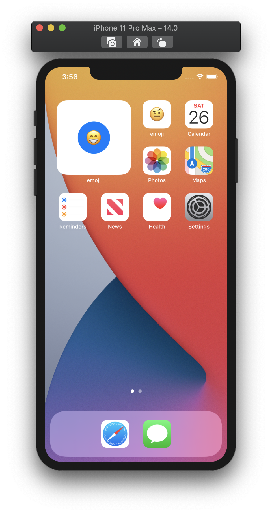

# emoji

This is my first experience with iOS 14 Widgets (and Swift 😱)

Here is some preview of what I end up with:

# credits

Kudos to [@Kilo-Loco](https://github.com/Kilo-Loco) for [this amazing first hands on Widgets](https://youtu.be/wOrkcdeui4U)
